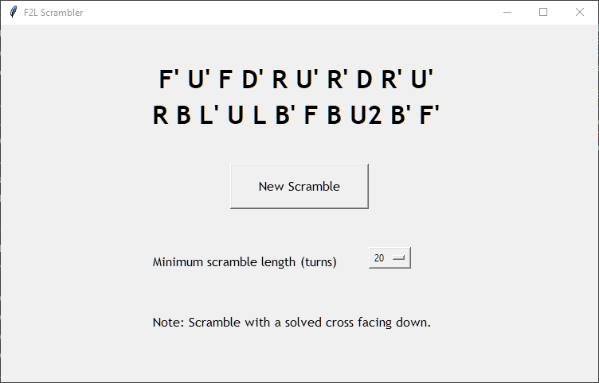
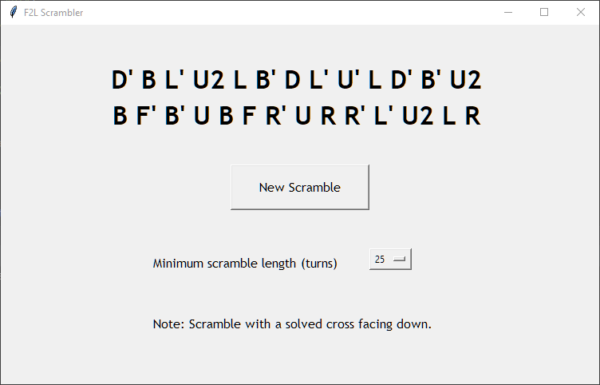
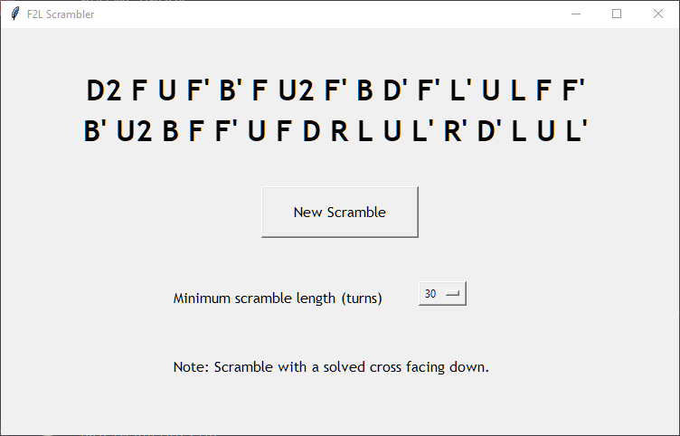

# F2L Scrambler

This program generates a scramble sequence for the 3x3 Rubik's cube 
without breaking the solved cross pieces.

It is intended for speedcubers who solve the cube using CFOP to practise their F2L.

# Sample Scrambles

1. 20-move scramble:

2. 25-move scramble:

3. 30-move scramble:

# How to Use

1. Run F2L Scrambler.exe in the output folder. The exe was compiled on Windows 8.1 platform. 
It may not work on other platforms.
2. If the above fails, run main.py on your local machine. 
You will need to have python installed.
3. Press the "New Scramble" button whenever you need a new scramble sequence.
4. By default, the program generates a scramble that is at least 20 turns long. 
You can change it to 25 or 30 turns in the drop down menu.

# Software Info

- Developed in Python 3.9 on Windows 8.1.
- GUI was developed using Tkinter.
